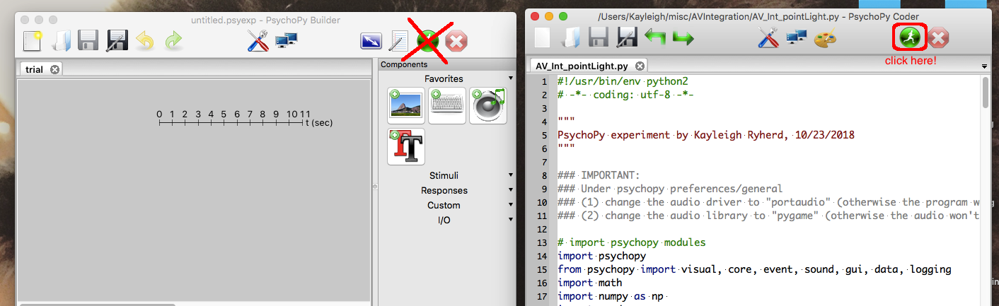
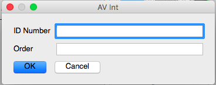
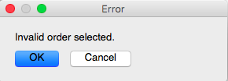

# Audio-Visual Integration

This folder contains the behavioral PsychoPy version of the AV Integration experiment (for more info on the paradigm, see [Irwin et al., (2016)](https://asa.scitation.org/doi/abs/10.1121/1.4971110) and [Irwin et al., (2018)](http://booksandjournals.brillonline.com/content/journals/10.1163/22134808-00002580).

### Contents:
* `AV_Int_pointLight.py` - this is the PsychoPy experiment.
* `audio` - contains audio files
* `video` - contains video files
* `stim` - contains stimulus files. If you want to change which videos appear, look at the files in here.

## Experiment Structure

The experiment runs through tasks 1 and 2 continuously. You can take a break by pausing at the instruction screens.

### Task 1: Audio-visual integration, 2-alternative forced choice

This task has 3 blocks of 100 trials each. In each block, 50 trials have the `ba_base` sound and the other 50 have the `ba_redu` sound. Each block has only one type of stimulus (AV/face, PIX/pixelated face, or PL/point-light).

Participants respond to each stimulus by pressing either `f` or `j` to indicate which sound they heard.

Results files for this task are labeled `AVINt_2AFC_sub-XXXX.csv`.

### Task 2: Audio-visual integration, goodness ratings

In this task, participants see stimuli and are asked to respond how good of a /ba/ sound they heard (strong/medium/weak/none). Stimuli type (AV/PIX/PL) are presented randomly. There are 18 trials of each type (9 /ba/ and 9 /a/).

Participants respond by pressing `1`, `2`, `3`, or `4` to indicate how good the /ba/ sound was. They have 10 seconds to respond. The next trial begins either after they make a response, or after 10 seconds have elapsed (whichever comes first).

Results files for this task are labeled `AVInt_goodness_sub-XXXX.csv`.

## How to Run

0. Make sure you have [PsychoPy](http://psychopy.org/installation.html) up an running on your computer. This will include installing Python 2.7.   
1. Download the `misc` respository by going to [this](https://github.com/kryherd/misc) page and clicking Clone or Download (green button).
2. Copy the `AVIntegration` folder into your desired location. (You can delete the other folders).
3. Open PsychoPy.
4. Click View > Open Coder View.
5. Click File > Open... and select the `AV_Int_pointLight.py` file.
6. Click the little green man to run. **IMPORTANT:** Make sure you are running from the **CODER** view, **not** the Builder view. You should see the code pop up in Coder View before you run. See below.

7. A dialog box should pop up (like the one below). 

* ID Number: Participant Number
* Order: Order of AV blocks (see below).

| Order Number 	|   Block 1   	|   Block 2   	|   Block 3   	|
|:------------:	|:-----------:	|:-----------:	|:-----------:	|
|       1      	|     Face    	| Point-light 	|  Pixelated  	|
|       2      	|     Face    	|  Pixelated  	| Point-light 	|
|       3      	| Point-light 	|     Face    	|  Pixelated  	|
|       4      	| Point-light 	|  Pixelated  	|     Face    	|
|       5      	|  Pixelated  	|     Face    	| Point-light 	|
|       6      	|  Pixelated  	| Point-light 	|     Face    	|

If you pick an order that is not 1-6, you'll see the error below and the experiment will close.

* Computer Type: Select either PC or Mac, depending on which type of computer you are using.

* Experiment Type: This allows you to run either the full experiment (Full) or a shortened version (Clipped) for testing it out. All experimental participants should be run using Full, but if you want to check something quickly or demo the experiment, you can use Clipped.

8. From there the experiment should run pretty smoothly. Read through the instructions with the participant.
9. If at any point you need to quit the experiment unexpectedly, press the `ESCAPE` key. This will stop after the next trial. The data you have collected so far will be saved as `early_quit_sub-XXXX.csv`. This only works during the actual trials, not during instruction screens.

Contact me at [kayleigh.ryherd@uconn.edu](mailto:kayleigh.ryherd@uconn.edu) if you have any issues.

## Troubleshooting

A lot of the errors that happen in this experiment come because the laptop we are using is very old and has a (relatively) small amount of memory. The main thing you should focus on is not overloading the machine. Ways to do this include:

* **Restart the computer between participants**: If you try to run the task too many times, you might see a blank screen between trials. This means that the experiment is dropping frames. Restart the computer and try again.
* **Give the computer time to boot up**: If you try to open PsychoPy right as the computer is starting, it will not appear to open. Give the computer solidly 5 minutes to boot.

These are the issues that I have run into. If you have any more, let me know and I'll try to fix them.