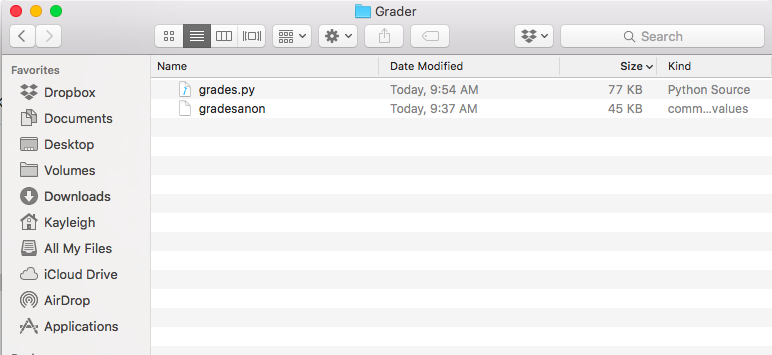
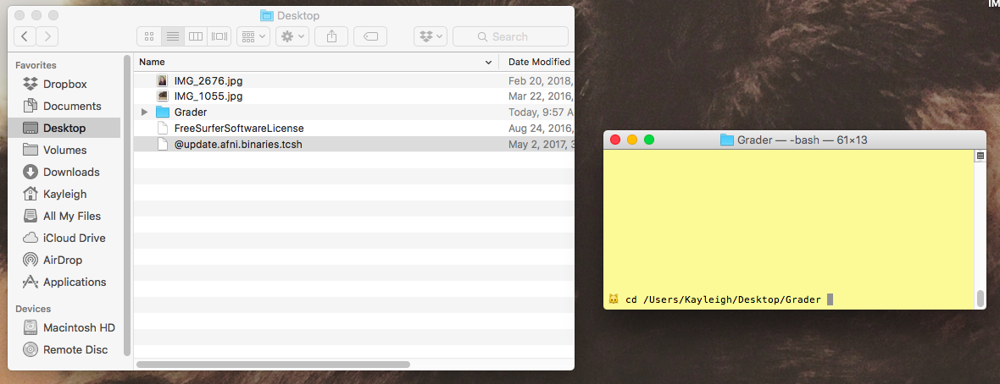
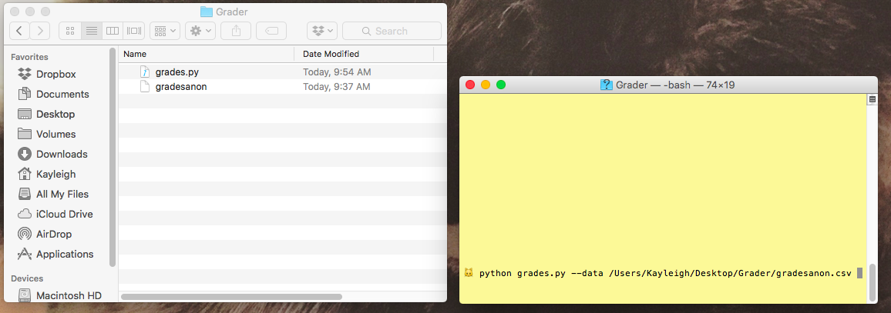
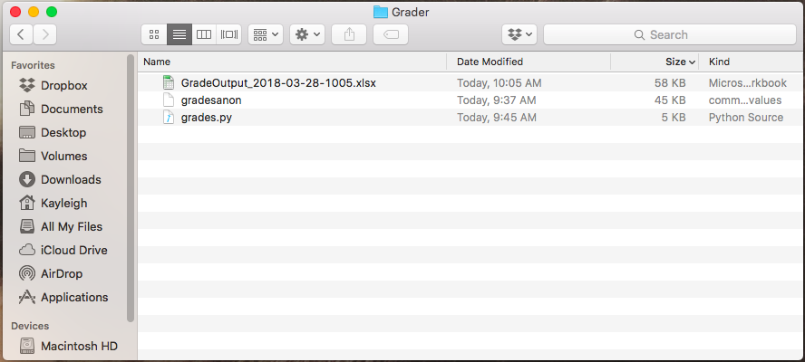
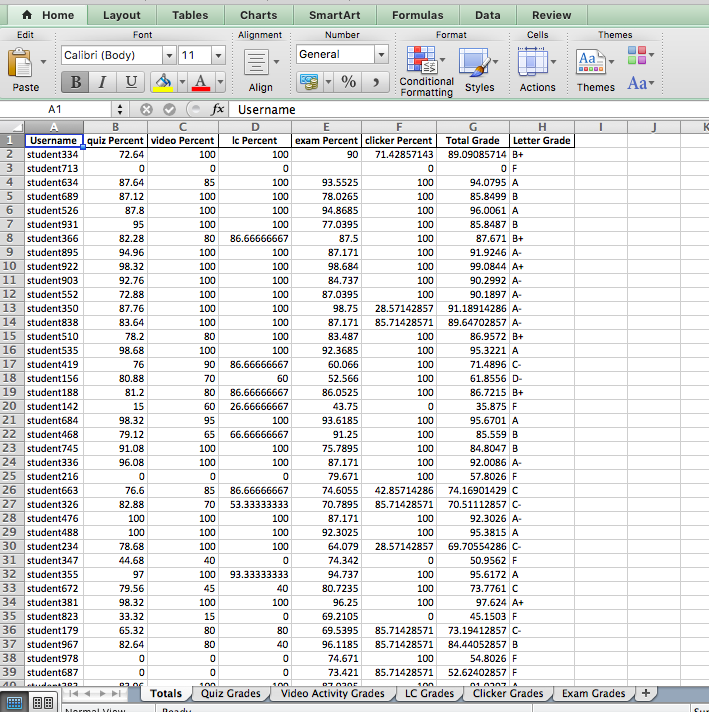

# Grading Script for PSYC 2400

This script will take the raw output from the HuskyCT grade center (Work Offline > Download) and calculate numeric and letter grades for all students.

**Features**:

* Dropping unassigned work: This script removes any assignments that 80% of the class has not completed, effectively removing assignments that are not due yet.
* Removing previewusers: This script removes all previewuser accounts.
* Dropping two lowest scores: For quizzes, video activities, learning curve, and clicker, this script removes the two lowest scores and calculates averages without those scores.

The output of this script is an Excel file with all of the grade information organized by sheets.

### Installing Python 2.7

You will need Python installed on your computer to run this script. Click [here](https://www.anaconda.com/download/#macos) to go to the Anaconda website. You will want to choose **Python 2.7 version**. 

### Running the script

Once you have downloaded and installed Python, you can run the script. 

1. Download the script (`grades.py`) and place it in some folder. Click [here](https://minhaskamal.github.io/DownGit/#/home?url=https://github.com/kryherd/misc/blob/master/Grader/grades.py) to download. You will have to unzip the file.
2. To make it easier, copy your grade center download into the same folder. I've renamed an edited grade center file to `gradesanon` in my folder.

3. Open up Terminal. You can find it in Applications > Utilities.
4. Navigate to your folder. Type `cd` into Terminal and then drag and drop your folder. Press enter.

5. Run the script. Type `python grades.py --data` and then drag your grade center download file into Terminal. Press Enter.

6. You should get an output excel file labeled with the date and time it was created.

7. You can open the output file in Excel. It has separate sheets for all of the sections of the course.

Hopefully this is sufficiently clear and will make grading everything *so* much easier.