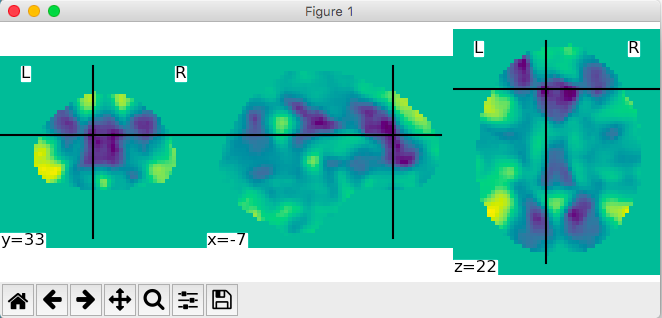
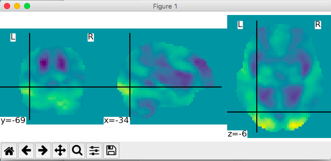
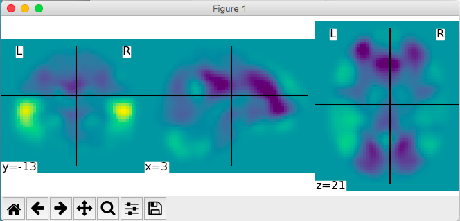
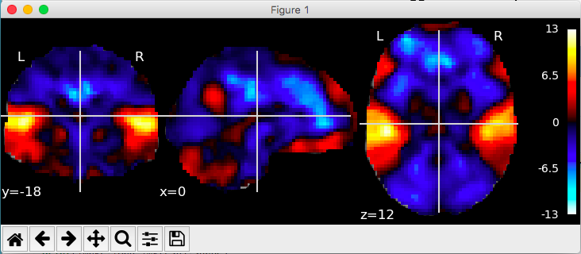
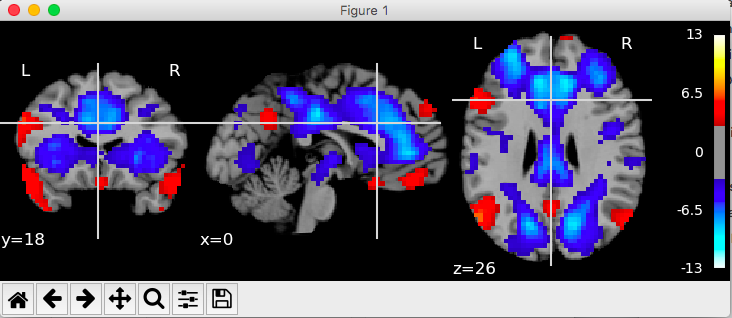
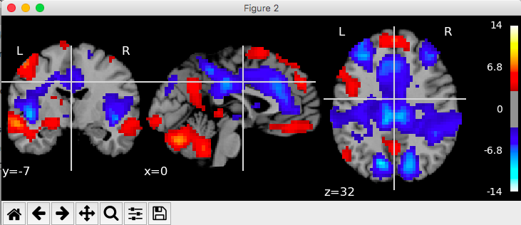

# Nilearn Examples

I am using a dataset of 113 subjects completing an audio/visual story comprehension task. When I use the contrasts, it's the group data from a 32-subject subset.

### Task/data details

54 x 64 x 50 voxels (3mm x 3mm x 3mm)

### Troubleshooting tips:

I had some issues getting very simple plots to show up. One thing to check is that when you start ipython you start it with ``ipython --matplotlib``. That way you don't have to separately import matplotlib.

I also got a lot of "backend" errors and things like that. Originally I had matplotlib 2.1.0 installed, so I tried downgrading to 2.0.2. This made more errors! So I tried re-updating matplotlib and it gave me 2.2.0. This made the plots work just like the [nilearn documentation](http://nilearn.github.io/auto_examples/plot_nilearn_101.html) says they will!

**Moral of the story**: update your packages!

## Manipulating and looking at data

First we will just look at some images.

```{python}
aud = "./Data/tb9769_vis.nii"
plotting.plot_img(aud)
```



```{python}
vis = "./Data/tb9769_aud.nii"
plotting.plot_img(vis)
```



In the auditory image you can definitely see some auditory activation, even at the single-subject level.

Now we will smooth the images. They've already been smoothed so we choose a pretty big FWHM.

```{python}
from nilearn import image
smooth_aud_img = image.smooth_img(aud, fwhm=10) # in-memory object
print(smooth_aud_img)
plotting.plot_img(smooth_aud_img)
```


## 3D and 4D niimgs: handling and visualizing

Now we will look at some plots!

```{python}
bg = "./Data/TT_N27.nii" # using TT_N27 atlas
plotting.plot_stat_map(aud, bg) #no threshold
```



```{python}
plotting.plot_stat_map(aud, bg, threshold=3)
plotting.plot_stat_map(vis, bg, threshold=3)
```




Here we see images more like what we're use to seeing in AFNI. There's what looking like DMN-related deactivation, probably because these contrasts are audio/visual minus rest.

For info on 4D plotting, see [the documentation](http://nilearn.github.io/auto_examples/plot_3d_and_4d_niimg.html). (I don't have data for this.)

## Intro tutorial to fMRI decoding

Here I'm gonna use the EPI data from a single subject. I grabbed run 1 of the story task from subject tb0209. I took the anat_final file from the AFNI preprocessing and used `3dAutomask` on it. Then I took the blurred/normalized EPI data (pb03) from run 1. I checked to make sure all of these images line up (they do!).

```{python}
# load epi data
fmri_filename = nib.load("./Data/epi.nii")

# look at mask
mask_filename = "./Data/mask.nii"
plotting.plot_roi(mask_filename, bg_img="./Data/anat_strip.nii",
                 cmap='Paired')

# use the masker to mask the fMRI data

from nilearn.input_data import NiftiMasker
masker = NiftiMasker(mask_img=mask_filename, standardize=True)

# We give the masker a filename and retrieve a 2D array ready
# for machine learning with scikit-learn
fmri_masked = masker.fit_transform(fmri_filename)
```

This worked, but it made my computer super hot! I think it might be worthwhile to pick some ROIs (auditory cortex anyone??)
