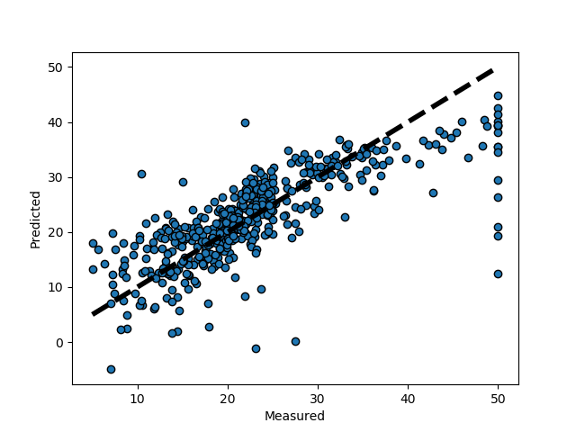

# Scikit-learn example notes

Here is me working through the scikit-learn examples. Fun!

## Plotting Cross-Validated Predictions

[This](http://scikit-learn.org/stable/auto_examples/plot_cv_predict.html#sphx-glr-auto-examples-plot-cv-predict-py) example shows how to use cross_val_predict to visualize prediction errors.

This example uses the Boston house-prices dataset. The target value (i.e., dependent/outcome variable -- the thing we're trying to predict) is `MEDV` -- `Median value of owner-occupied homes in $1000's`. (More information on the data can be found [here](http://archive.ics.uci.edu/ml/machine-learning-databases/housing/housing.names)).

It uses cross-validation to predict values using the same set. We split the dataset into smaller sets, using all but one of the smaller sets to train the model and then testing it on the remaning set. 

`cross_val_predict` gives us, for each element, the predicted value for that element when it was in the test set.

In the example below, it takes some arguments. The first is the estimator object -- here a linear model `lr`. The second is the input data (what we are fitting the linear model on). The third is the data to try and predict (the test set). The fourth is the `cv` parameter. In this case, we are using it to do a 10-fold cross-validation. We are splitting the data into ten smaller sets.

```python

from sklearn import datasets
from sklearn.model_selection import cross_val_predict
from sklearn import linear_model
import matplotlib.pyplot as plt

lr = linear_model.LinearRegression()
boston = datasets.load_boston()
y = boston.target

# cross_val_predict returns an array of the same size as `y` where each entry
# is a prediction obtained by cross validation:
predicted = cross_val_predict(lr, boston.data, y, cv=10)

fig, ax = plt.subplots()
# add scatterplot points
ax.scatter(y, predicted, edgecolors=(0, 0, 0))
# add a black dotted line ('k--')
ax.plot([y.min(), y.max()], [y.min(), y.max()], 'k--', lw=4)
ax.set_xlabel('Measured')
ax.set_ylabel('Predicted')
plt.show()

```

We get the plot below.



This helps us visualize prediction errors. Items along the line are pretty well-predicted and those off the line are not. It seems like values near the ceiling (50) are not predicted very well, and that prediction accuracy goes down as median value goes up more generally.

## Concatenating multiple feature extraction methods

This example shows us how to combine multiple features that are obtained from PCA. It allows for cross validation and grid searching. Cross validation is described above. Grid searching refers to testing multiple models and then using cross-validation to select the best one.

In this example we are using the [iris](https://archive.ics.uci.edu/ml/datasets/iris) dataset, which contains information about sepal and petal length and width for three classes of irises.

The idea here is that we want to both use a PCA over the four continuous variables and use univariate selection to choose the best continuous variable for predicting class. So, we use `FeatureUnion` and combine these features.

```python
# Author: Andreas Mueller <amueller@ais.uni-bonn.de>
#
# License: BSD 3 clause

from sklearn.pipeline import Pipeline, FeatureUnion
from sklearn.model_selection import GridSearchCV
from sklearn.svm import SVC
from sklearn.datasets import load_iris
from sklearn.decomposition import PCA
from sklearn.feature_selection import SelectKBest

iris = load_iris()

X, y = iris.data, iris.target

# This dataset is way too high-dimensional. Better do PCA:
pca = PCA(n_components=2)

# Maybe some original features were good, too?
selection = SelectKBest(k=1)

# Build estimator from PCA and Univariate selection:

combined_features = FeatureUnion([("pca", pca), ("univ_select", selection)])

# Use combined features to transform dataset:
X_features = combined_features.fit(X, y).transform(X)

svm = SVC(kernel="linear")

# Do grid search over k, n_components and C:

# pipeline tells it which transforms to do, followed by a final estimator
# so here first it does the combined_features transform then fits the SVM
pipeline = Pipeline([("features", combined_features), ("svm", svm)])

# this tells it what kinds of models we want to try out in our grid search
# PCA with 1-3 components
# select the best 1-2 features
# Use a C of .1, 1, or 10 in SVM
param_grid = dict(features__pca__n_components=[1, 2, 3],
                  features__univ_select__k=[1, 2],
                  svm__C=[0.1, 1, 10])

grid_search = GridSearchCV(pipeline, param_grid=param_grid, verbose=10)
grid_search.fit(X, y)
print(grid_search.best_estimator_)

```